# C++ Primer Plus 学习笔记

## 第一章预备知识

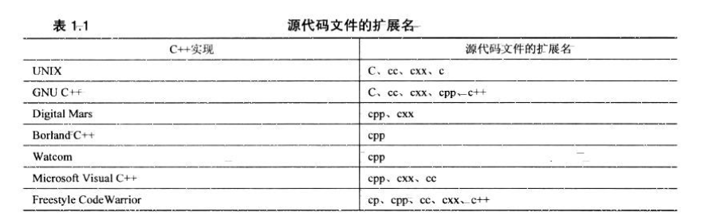

## 第四章 复合类型

### 4.1 C风格字符串

```c
char dog[8] = {'a','b','c','d','e','f'};	//字符数组
char cat[8] = {'a','b','c','d','e','\0'};	//c风格字符串
char pig[8] = "winter";						//c风格字符串,默认加\0
char red[] = "red";							//c风格字符串
```

* **用引号括起的字符串隐式地包括结尾空字符, 不用显式地包括它**
* **确定存储字符串所需的最短数组时,需要将空字符计算在内**

### 4.4 结构体

**第一种方式**

```c
struct {
    char name[20];
    int age;
}user;
user.age = 10;	//全局只能使用一个user变量
```

**第二种方式**

```c
 struct person{
     int age;
 }mp1,mp2;
mp1.age = 8;
struct person p{18};

//允许初始化多个变量mp1...
```

**方式三**

```c
typedef struct {
    int age;
}student;

student  s;
s.age = 8;
student b;
b.age = 9;

typedef struct dog {
    int age;
}dog;

//初始化
struct Student s = {8};
struct Student s1{9};
student s3 = {8};
student s4{9};

//这两种方式的区别是, dog既可以用 struct dog d; 声明结构体也可以 dog d;声明
//而student只能是 student s;声明
```

### 4.7 指针

***运算符两边的空格是可选的,**

**传统上,C程序员使用这种格式:**

```c
int *ptr;	//强调*ptr是一个int类型的值
```

**C++程序员使用这种格式:**

```c
int* ptr;	//强调int*是一种类型  指向int的指针
```

**一定要在对指针应用解除引用运算符(*)之前,将指针初始化为一个确定的,适当的地址**

#### 4.7.4 使用new来分配内存

```c
int *pn = new int;	//pn指向一个数据对象
delete pn;

int* arr = new int[5];
arr += 1;
delete[] arr;	//需要将arr-=1,才能释放
```

## 第六章 分支语句

```c
#include <ctype.h>
#include <cctype>
```

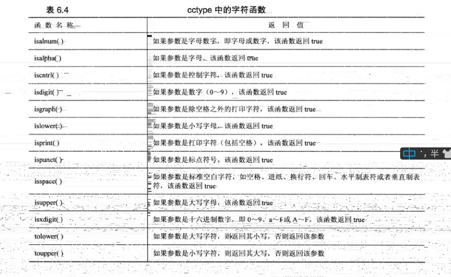

## 第七章 函数

函数基本知识:

* 提供函数定义(实现)
* 提供函数原型(声明)
* 调用函数

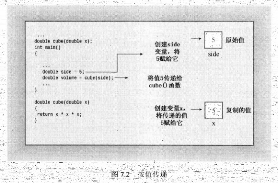

```c
int sum_arr(const int *arr, int size);
int cookies[5] = {1,2,3,4,5};
int sum_arr(const int *arr, int size) {
    int total = 0;
    for (int i = 0; i < size; i++) {
        total += *(arr + i);
    }
    return total;
}
```

* **对数组名使用sizeof得到的是整个数组地址**

* **数组名是第一个元素地址**

* **将地址运算符&用于数组名时,将返回整个数组的地址, 将返回一个内存块的地址**

**重要恒等式: **

```c
arr[i] = *(arr + i);
&arr[i] = arr + i;
```

### 7.4 函数和二维数组

```c
int data[2][2] = {{1,2},{3,4}};
int total = sum(data, 2);
// 二维数组计算和对应的函数原型
int sum(int (*ptr)[2], 2);
```

### 7.5 函数和C-风格字符串

将字符串作为参数传递给函数, 则表示字符串的方式有三种

* char数组;
* 用引号引起的字符串常量
* 被设置为字符串地址的char指针

*C-风格字符串与常规char数组之间最重要的区别是,字符串有内置的结束字符'\0'

**返回C-风格字符串函数**

```c
char *buildstr(char c, int n){
    char *pstr = new char[n + 1];
    pstr[n] = '\0';
    while (n-- > 0)
        pstr[n] = c;
    return pstr;
}

char *ps = buildstr(ch, counts);
delete[] ps;
```

```c
Human createHuman() {
    Human human{"braveheart", 55};
    cout << "create : " << &human << endl;
    return human;
}
Human human = createHuman();
cout << "test: " << &human;
create : 0x63fd90
test: 0x63fd90

```

### 7.10 函数指针

```c
double pam(int);
double (*pd)(int);
```

相同的函数原型表示

```c
const double *f1(const double ar[], int n);
const double *f1(const double[], int n);	//可以省略标识符
const double *f1(const double*, int n);	//double ar[] = double*
```

简单函数指针示例:

```c
int (*sum)(int,int);
int test88(int,int,int (*func)(int,int));
int sumimpl(int,int);	//sum定义
int main() {
   sum = &sumimpl;
   int ret  = test88(8,9, sum);
   cout << ret << endl;
   return 0;
}

int test88(int a,int b,int (*func)(int,int)) {
    return (*func)(a,b);
}
//sum实现
int sumimpl(int a,int b) {
    return a +b;
}

```

#### 7.10.4 使用typedef简化函数指针

```c
typedef const double* (*p_fun)(const double*,int);
p_fun p1 = f1;

p_fun pa[2] = {f1,f2};
p_fun (*pd)[2] = &pa;
```

---

## 第八章 函数

### 8.1 内联函数

**内联函数的运行速度比常规函数快, 代价是需要占用更多内存**

```c
inline double square(double x) { return x * x; }
```

### 8.2 引用

引用是已定义变量的一个别名

```c
int rate = 101;
int& alias = rate;
```

### 8.3 默认参数

```c
int harpo(int n, int m = 4, int j = 5);	//valid
int chico(int n, int m = 6, int j);	//invalid
```

*对于带参数列表的函数, 必须从右向左添加默认值, 如果要为某个参数添加默认值,则必须为它右边的所有参数提供默认值

### 8.5 函数模板

```c
template<typename T>
T sum(T& t, T& t2) {
    return t * t2;
}
```

#### 8.5.2 模板的局限性

```c
template <class T>
void f(T a, T b)
{...}
```

* 如果T为数组,	则 a = b 不成立(=)
* 如果T为结构,    则 if (a > b) 不成立(>)
* 如果T为数组,    则 T c = a * b 不成立(*)

#### 8.5.2 实例化和具体化

````c
template<class T>
T calc(T& t, T& t1) {
    return t * t1;
}

template <> int calc<int>(int&,int&);

template <> int calc(int&,int&);	//显式实例化

````

**模板参数类型匹配**

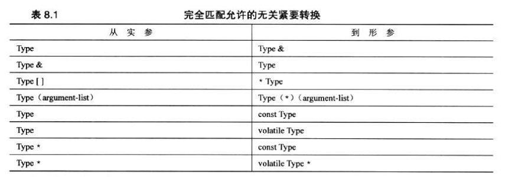

---

## 第九章 内存模型和名称空间

程序组成:

* 头文件: 包含结构声明和使用这些结构的函数原型.
* 源代码文件: 包含于结构相关的函数的代码
* 源代码文件: 包含调用与结构相关的函数的代码

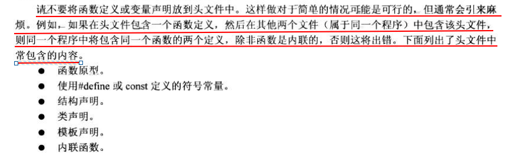

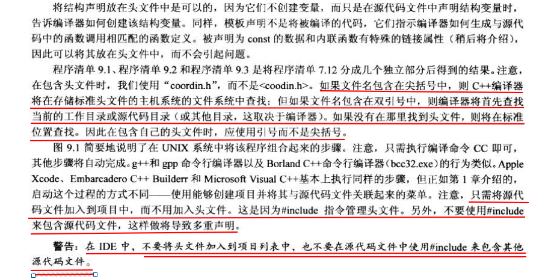

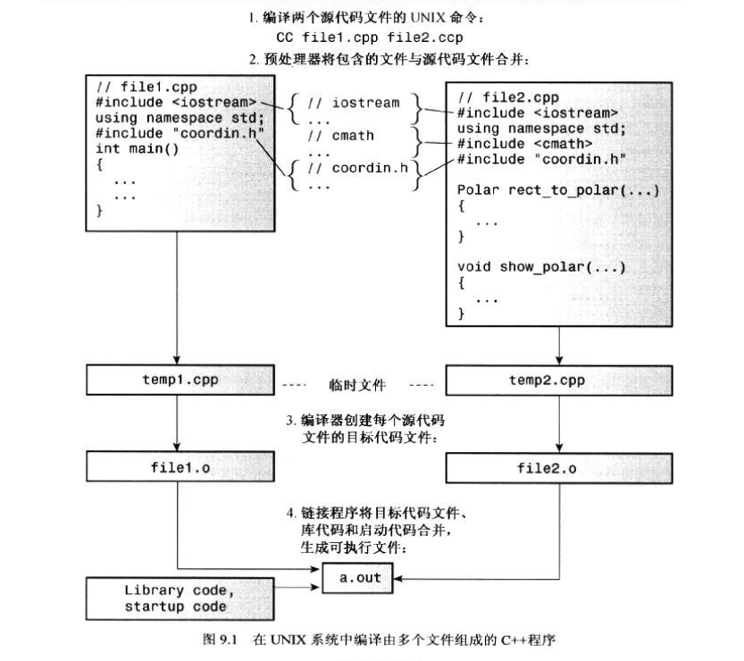

**头文件定义**

```1
#ifndef COORDIN_H_
#define COORDIN_H_
...
#endif //COORDIN_H_
```

#### 9.2.3 静态持续变量

c++为静态存储持续性变量提供了3种链接性:

1. 外部链接性(可在其他文件中访问)
2. 内部链接性(只能在当前文件中访问)
3. 无链接性(只能在当前函数访问)

```c
int global = 1000; //外部
static int code = 50;	//文件内部

void func() {
    static int count = 3;	//局部链接性
    ..
}
```

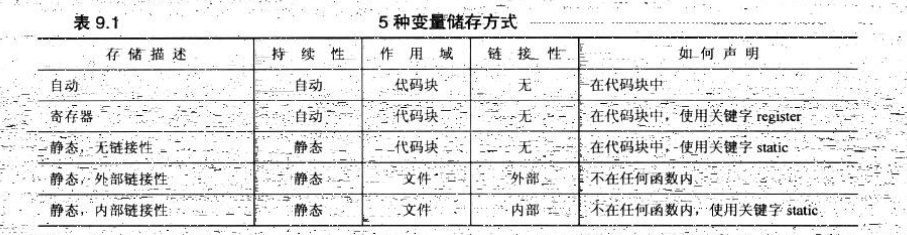

#### 9.2.4 静态持续性,外部链接性

**单定义规则**

"单定义规则(One Definition Rule, ODR)" 两种变量声明:

* 定义声明(definine declaration), 简称定义,直接给变量分配存储空间
* 引用声明(reference declaration), 简称声明, 它不给变量分配存储空,因为它引用已有变量,引用声明使用关键字extern,且不进行初始化, 否则声明为定义

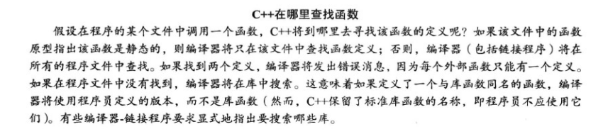

```c
extern "C" void spiff(int);	//C语言链接性
extern void spoff(int);	//C++语言链接性
extern "C++" void spiff(int); //C++语言链接性
```

#### 9.2.10 存储方案和动态分配方案

new 初始化

```c
int *pi = new int(6);
where *one = new where{2.5,5.3,7.2};
```

### 9.3 名称空间

```c
namespace ZhangJunPu{
    int age = 28;
    namespace WinterSweett {
        int age = 18;
    }
    void fetch(){
    }
}

void fetch() {
}
```

using声明和using指令

```c
//using指令: 表示会导入所有名称空间为ZhangJunPu下面的所有内容
using namespace ZhangJunPu;

//using声明	相当于只导入了age,其它并未导入
using ZhangJunPu::age;
```

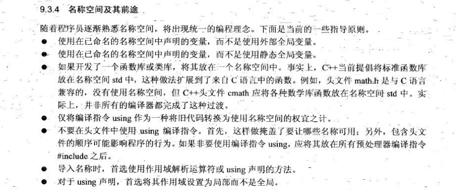

---

## 第十章 类和对象

**什么是接口?**

> 接口是一个共享框架, 供两个系统交互时使用.

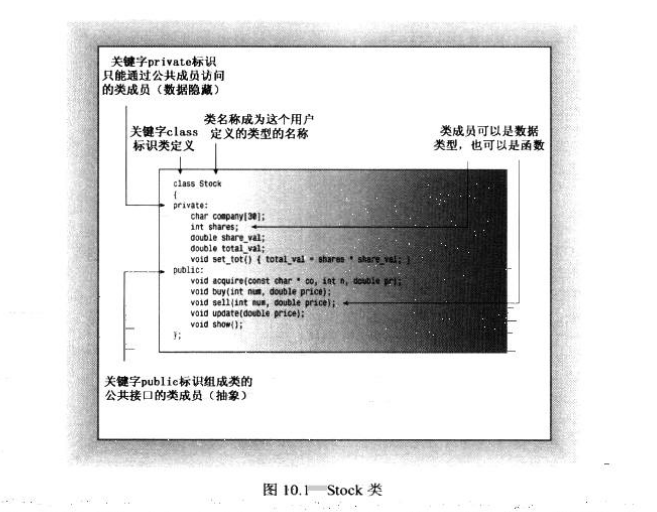

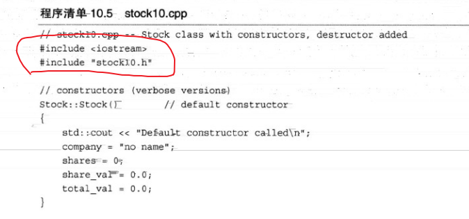

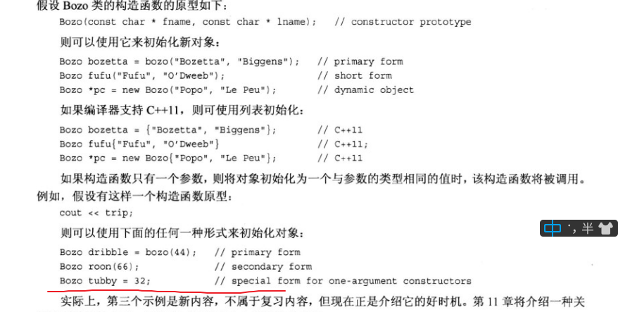

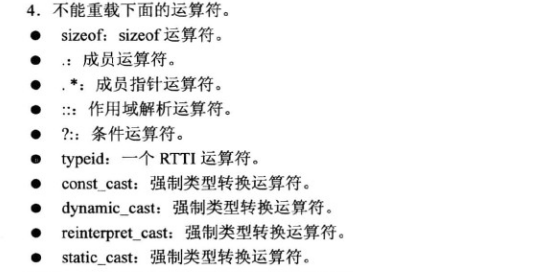

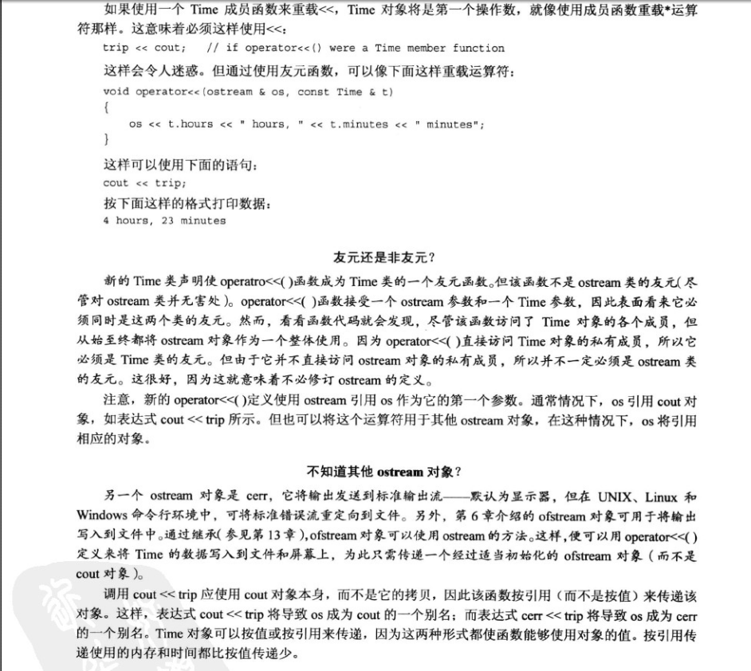

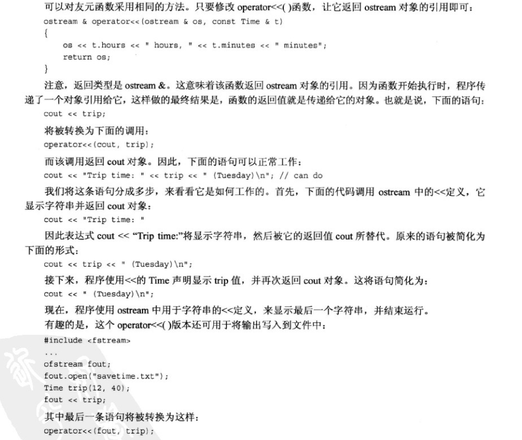

---

## 第十二章  类和动态内存分配

> 不能再类声明中初始化静态成员变量:
>
> 因为声明描述了如何分配内存, 但并不分配内存.
>
> 在c++类中,初始化放在方法文件中,不应该放在类声明文件中,因为类声明文件位于头文件中,程序可能将头文件包括在其他几个文件中.如果在头文件中进行初始化,将出现多个初始化语句副本,从而引发错误

### 12.1 动态内存和类

#### 12..1.2 特殊成员函数

C++自动提供的构造函数:

* 默认构造函数,如果没有定义构造函数
* 默认析构函数,如果没有定义;
* 复制构造函数,如果没有定义
* 赋值运算符,如果没有定义
* 地址运算符,如果没有定义

1.默认构造函数

​	Student::Student() {}

2.复制构造函数

​	Class_name(const Class_name &)

**复制构造函数调用时机? 有何功能?**

新建一个对象并将其初始化为同类现有的对象时,复制构造函数都将被调用,

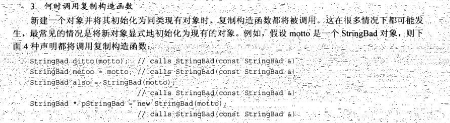

**复制构造函数不重写可能带来的问题**

```c++
StringBad::StringBad(const char *s) {
    len = strlen(s);
    str = new char[len + 1];
    strcpy(str,s);
    ++obj_count;
    cout << obj_count << "   :  \n";
}

StringBad::~StringBad() {
    --obj_count;
    cout << obj_count << "   :  \n";
    delete [] str;
}
```

1.obj_count计数器会变成负数,因为默认的复制构造函数没有对obj_count操作

2.默认的复制构造函数不经过任何处理,在临时的对象析构函数会提前释放新对象指向的内存(默认复制构造函数是浅拷贝)

### 12.3 在构造函数中使用new的注意事项

- 如果构造函数中使用new,则应在析构函数中使用delete
- new和delete必须互相兼容, new对应delete, new[]对应delete[]
- 如果多个构造函数,必须以相同的方式使用new,要么都不带,要么都带

**NULL,0,nullptr**

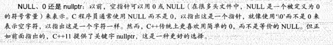

* 定义一个复制构造函数,通过深度复制将一个对象初始化为另一个对象.

  ```c
  String::String(const String & st) {
  	len = st.len;
      str = new char[len + 1];
      strcpy(str, st.str);
  }
  ```

* 应当定义一个赋值运算符,通过深度复制将一个对象复制给另一个对象

  ```c
  String & operator=(const String & st) {
      if (this == &st)
          return *this;
      delete [] str;
      len = st.len;
      str = new char[len + 1];
      strcpy(str, st.str);
  }
  ```

  ### 12.6 重点

  **重载<<运算符**

  ```c
  ostream & operator<<(ostream & os, const c_name &obj)
  {
  	return os;
  }
  ```

  **转换函数**

  将单个值转换为类类型,需要创建原型如下的类构造函数

  c_name(type_name value);

  c_name:类名  type_name:转换类型的名称.

  ---

  ## 第十三章 类继承

  
